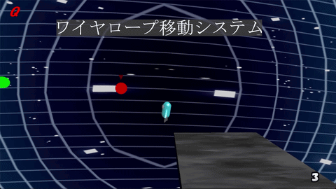
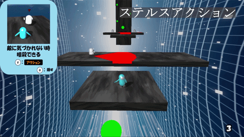
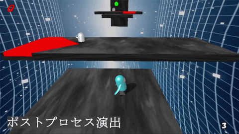
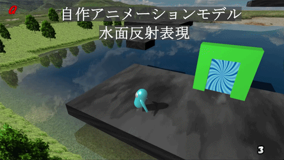
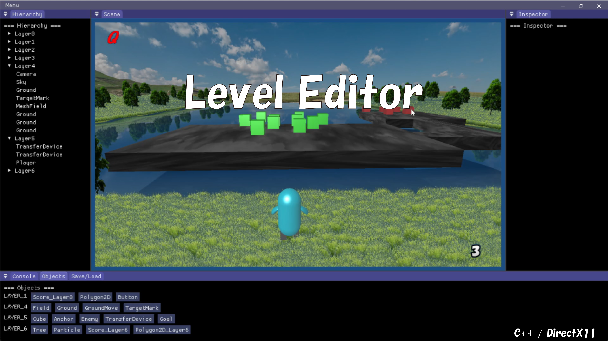
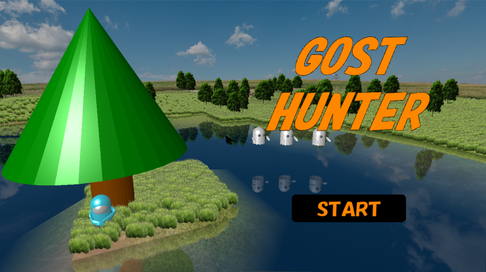

# Game Engine (DirectX11)

## ■ 概要
C++とDirectX11を用いて開発した自作ゲームエンジンです。  
GameObject / Component構造を採用し、描画処理・シーン管理・衝突判定・エディタ機能まで実装しました。  
拡張性と保守性を意識し、機能追加時に既存構造を大きく崩さずに開発を進められる設計を目標としています。

---

## ■ デモ

### ▶ ワイヤーアクション（移動システム）

### ▶ ステルス（敵AI・暗殺）

### ▶ ポストエフェクト（ダメージ演出）

### ▶ 水面反射（リアルタイム描画）

---

## ■ エディタ機能

ゲーム内でステージの配置・調整・保存を行える簡易エディタを実装しています。

---

## ■ プレイ動画（Full Gameplay）

---

## ■ 主な機能

### 【エンジン機能】
- GameObject / Componentシステム
- シーン管理・レイヤー管理
- シャドウマッピング
- 水面反射
- ポストプロセス
- ImGuiによる簡易エディタ
- JSONによるセーブ／ロード
- キーボード / マウス / ゲームパッド入力対応

### 【衝突判定システム】
- 点・線・三角形
- 球体
- OBB（有向境界ボックス）
- カプセル
- メッシュ（三角形ベース）

各形状ごとに判定ロジックを分離し、拡張可能なShape構造で実装しています。  
最近接点計算や押し戻しベクトルの算出にも対応しています。

---

## ■ Sample Game - GOST HUNTER

本エンジンを用いて制作した三人称視点のステルスアクションゲームです。  
エンジン機能の実証を目的として開発しました。

### 概要
- 三人称カメラ（モード切替・補間処理）
- 敵AIによる索敵・追跡
- ステージ遷移
- UI表示
- セーブ／ロード機能
- キーボード / マウスに加え、ゲームパッド操作にも対応

### 技術的工夫
- カメラモード切替時の補間処理
- 描画とロジックの責務分離
- レイヤー管理による描画制御
- 衝突判定システムを活用した当たり判定処理
- 入力管理の共通化による複数デバイス対応
- 処理負荷を意識した設計改善

### 操作方法

#### キーボード / マウス
- **W / A / S / D** : 移動
- **マウス移動** : 視点操作
- **Shift** : 射撃モード
- **P** : クリエーターモード切替（インゲームエディタを起動）

#### ゲームパッド
- **左スティック** : 移動
- **右スティック** : 視点操作
- **各種ボタン入力** : アクション切替 / UI操作対応中

※ 基本操作は上記の通りです。  
※ 各ステージやギミックに応じた細かい操作説明は、ゲーム内UIで案内する設計にしています。

※ 一部操作は現在も調整を続けており、キーボード操作とゲームパッド操作の両方で快適に扱えるよう改善しています。

---

## ■ 技術スタック
- C++
- DirectX11
- HLSL
- ImGui
- SDL Gamepad Input

---

## ■ 設計方針
- 描画処理とゲームロジックの分離
- 拡張可能なコンポーネント設計
- Managerによるシーン制御
- 入力処理の抽象化によるデバイス依存の軽減
- 拡張時に既存構造を崩さない設計

---

## ■ 今後の改善
- マルチスレッド対応
- 描画最適化の強化
- エディタ機能の拡張
- ゲームパッド操作のさらなる調整
- 入力設定のカスタマイズ対応
