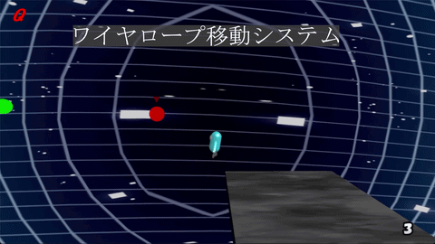
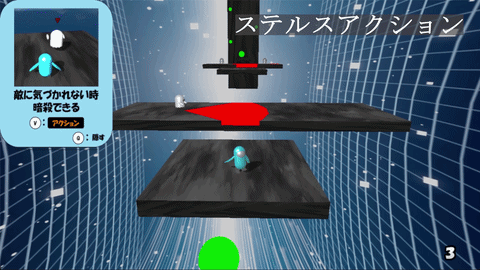
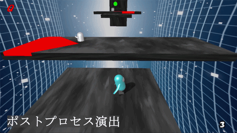
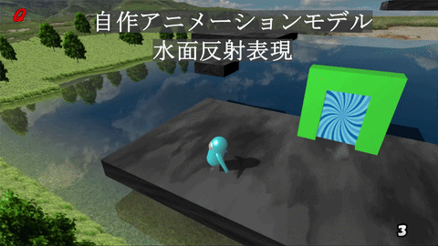
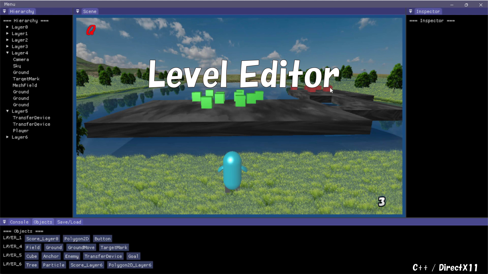
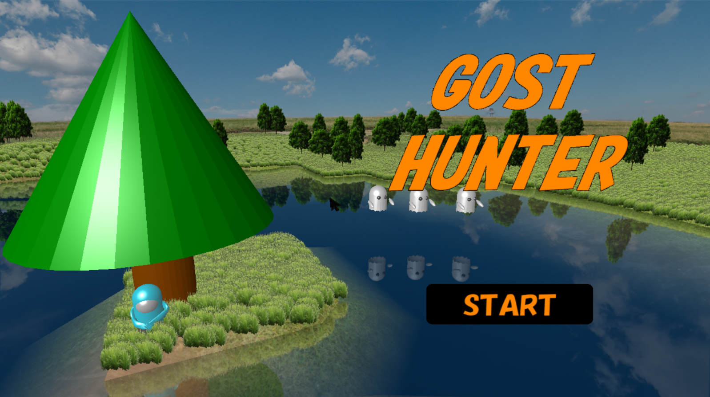

# 自作ゲームエンジン（C++ / DirectX 11）

## ■ 概要
Unity や Unreal Engine などの既存エンジンを使わず、**C++ と DirectX 11 の API から個人で一から作ったゲームエンジン**です。  
ウィンドウ生成・描画パイプライン・シェーダー・衝突判定・シーン管理・エディタまでを自作し、その上でサンプルゲーム「GOST HUNTER」を制作しました。  
物理エンジンや描画エンジンは使っておらず、影・水面反射・ポストエフェクト・当たり判定はすべて自分で実装しています。

| 項目 | 規模 |
|---|---|
| エンジン本体（C++、エディタ含む） | 約16,500行 |
| サンプルゲーム（C++） | 約8,800行 |
| シェーダー（HLSL） | 約1,800行 |
| うち衝突判定システム | 約4,700行 |

### 自作した部分と外部ライブラリ
外部ライブラリは「ファイル読み込み」と「入力・UIの土台」に限定し、エンジンの中核はすべて自作しています。

| 自作 | 外部ライブラリ（用途） |
|---|---|
| 描画パイプライン（Direct3D 11 を直接使用） | Assimp（FBX などモデルファイルの読み込み） |
| シャドウマップ・水面反射・ポストプロセス | DirectXTex（テクスチャ画像の読み込み） |
| HLSL シェーダー一式 | Dear ImGui（エディタの UI 部品） |
| 衝突判定（点・線・平面・球・OBB・カプセル・メッシュ） | SDL3（ゲームパッド入力の取得） |
| GameObject / Component・シーン・レイヤー管理 | nlohmann/json（JSON の読み書き） |
| セーブ／ロード（バイナリ・JSON）・インゲームエディタ | |
| 入力の抽象化（キーボード／マウス／パッドの共通化） | |

---

## ■ デモ

### ▶ ワイヤーアクション（移動システム）


### ▶ ステルス（敵AI・暗殺）


### ▶ ポストエフェクト（ダメージ演出）


### ▶ 水面反射（リアルタイム描画）


---

## ■ エディタ機能

ゲーム内でステージの配置・調整・保存を行える簡易エディタを実装しています。

[](https://youtu.be/64AvfK3Fevw)

---

## ■ プレイ動画（Full Gameplay）

[](https://youtu.be/8tW4SEGgKL0)

---

## ■ 1フレームの描画の流れ

`Manager::Draw()`（[manager.cpp](Engine/Core/manager.cpp#L110)）で、毎フレーム次の順に描画しています。

1. **シャドウパス**：ライト視点で深度だけを描き、シャドウマップを作る
2. **反射パス**：水面を境に反転させたカメラでシーンを描き、反射テクスチャを作る
3. **シーンパス**：通常のカメラでオフスクリーンのレンダーターゲットに描く（1・2 の結果をここで参照）
4. **ポストプロセス**：3 の結果を画面全体の板ポリゴンに貼り、フェードやダメージ演出のシェーダーを通してバックバッファへ出力
5. **エディタ**：クリエーターモード時のみ、ImGui のエディタ画面を重ねる

---

## ■ 主な機能

### 【エンジン機能】
- GameObject / Componentシステム
- シーン管理・レイヤー管理
- シャドウマッピング（PCF によるエッジの軟化）
- 水面反射（反射カメラ＋フレネル項）
- ポストプロセス
- ImGuiによる簡易エディタ
- JSON／バイナリによるセーブ／ロード
- キーボード / マウス / ゲームパッド入力対応

### 【衝突判定システム】
- 点・線・三角形
- 球体
- OBB（有向境界ボックス）
- カプセル
- メッシュ（三角形ベース）

各形状ごとに判定ロジックを分離し、拡張可能なShape構造で実装しています。  
最近接点計算や押し戻しベクトルの算出にも対応しています。

---

## ■ Sample Game - GOST HUNTER

本エンジンを用いて制作した三人称視点のステルスアクションゲームです。  
エンジン機能の実証を目的として開発しました。

### 概要
- 三人称カメラ（モード切替・補間処理）
- 敵AIによる索敵・追跡
- ステージ遷移
- UI表示
- セーブ／ロード機能
- キーボード / マウスに加え、ゲームパッド操作にも対応

### 技術的工夫
- カメラモード切替時の補間処理
- 描画とロジックの責務分離
- レイヤー管理による描画制御
- 衝突判定システムを活用した当たり判定処理
- 入力管理の共通化による複数デバイス対応
- 処理負荷を意識した設計改善

### 操作方法

#### キーボード / マウス
- **W / A / S / D** : 移動
- **マウス移動** : 視点操作
- **Shift** : 射撃モード
- **P** : クリエーターモード切替（インゲームエディタを起動）

#### ゲームパッド
- **左スティック** : 移動
- **右スティック** : 視点操作
- **各種ボタン入力** : アクション切替 / UI操作対応中

※ 基本操作は上記の通りです。  
※ 各ステージやギミックに応じた細かい操作説明は、ゲーム内UIで案内する設計にしています。

※ 一部操作は現在も調整を続けており、キーボード操作とゲームパッド操作の両方で快適に扱えるよう改善しています。

---

## ■ 技術スタック
- C++
- DirectX 11 / HLSL
- Visual Studio 2022（v143）
- 外部ライブラリ：Assimp / DirectXTex / Dear ImGui / SDL3 / nlohmann/json

## ■ ビルド方法
1. Visual Studio 2022（C++ によるデスクトップ開発）で `Engine.sln` を開く
2. 構成を `x64` の `Debug` または `Release` にしてビルド
3. リポジトリのルートを作業ディレクトリとして実行（`Assets/` と `Save/` を相対パスで読み込みます）

---

## ■ 設計方針
- 描画処理とゲームロジックの分離
- 拡張可能なコンポーネント設計
- Managerによるシーン制御
- 入力処理の抽象化によるデバイス依存の軽減
- 拡張時に既存構造を崩さない設計

---

## ■ 今後の改善
- マルチスレッド対応
- 描画最適化の強化
- エディタ機能の拡張
- ゲームパッド操作のさらなる調整
- 入力設定のカスタマイズ対応

---

## ■ コード抜粋

エンジンの中核として自作した4つの機能から、要となる部分を抜粋します（一部省略）。各見出しのリンクから全体を確認できます。

### 1. シャドウマッピング（PCF）
[depthShadowPS.hlsl](Engine/Rendering/Shader/depthShadowPS.hlsl)

ライト視点で描いた深度テクスチャと、各ピクセルのライト空間での深度を比べて影を判定します。  
1点だけで比べると影の輪郭がギザギザになるため、周囲4点をサンプリングして影の割合を求め、境界を滑らかにしています（PCF）。

```hlsl
In.LightPosition.xyz /= In.LightPosition.w;             // 正規化デバイス座標へ
In.LightPosition.x =  In.LightPosition.x * 0.5f + 0.5f; // テクスチャ座標へ変換
In.LightPosition.y = -In.LightPosition.y * 0.5f + 0.5f;

// ... シャドウマップの範囲外は影なしとして return（省略）

// PCF：周囲4点の深度と比較して影の割合を求める
float2 offset = float2(1.0f / 1280.0f, 1.0f / 720.0f);
float shadowRate = 0.0f;
float depth[4];
depth[0] = g_TextureShadowDepth.Sample(g_SamplerState, In.LightPosition.xy);
depth[1] = g_TextureShadowDepth.Sample(g_SamplerState, In.LightPosition.xy + float2(offset.x, offset.y));
depth[2] = g_TextureShadowDepth.Sample(g_SamplerState, In.LightPosition.xy + float2(offset.x, 0.0f));
depth[3] = g_TextureShadowDepth.Sample(g_SamplerState, In.LightPosition.xy + float2(0.0f, offset.y));

for (int i = 0; i < 4; i++)
{
    if ((In.LightPosition.z - 0.01f) > depth[i])   // 0.01f はシャドウアクネ対策のバイアス
    {
        shadowRate++;
    }
}

shadowRate /= 4.0f;
float3 shadowColor = outDiffuse.rgb * 0.5f;
outDiffuse.rgb = lerp(outDiffuse.rgb, shadowColor, shadowRate);
```

### 2. 水面反射（反射カメラ＋フレネル）
[renderer.cpp](Engine/Rendering/Renderer/renderer.cpp#L608-L653) / [waveRefPS.hlsl](Engine/Rendering/Shader/waveRefPS.hlsl)

水面を平面とみなし、カメラの位置と向きを平面で鏡映した「反射カメラ」でシーンを別テクスチャに描きます。

```cpp
// 反射カメラの位置と向きを、水面（planeNormal, planePoint）で鏡映する
float dist = planeNormal.dot(camPos - planePoint);
Vector3 reflPos = camPos - 2.0f * dist * planeNormal;
reflPos += planeNormal * 0.05f;

Vector3 reflDir = camDir - 2.0f * planeNormal.dot(camDir) * planeNormal;
reflDir.normalize();

XMMATRIX view = XMMatrixLookAtLH(/* reflPos から reflDir を見る */);
XMMATRIX proj = XMMatrixPerspectiveFovLH(camera->GetFov(), aspect, 0.3f, 1000.0f);

// 反射カメラの ViewProj をシェーダーへ渡す
XMStoreFloat4x4(&m_ReflectionViewProjFloat4x4, XMMatrixTranspose(view * proj));
SetReflection(m_ReflectionViewProjFloat4x4);
```

水面のピクセルシェーダーでは、そのピクセルを反射カメラで投影したUVで反射テクスチャを読み、見る角度に応じたフレネル項（Schlick 近似）で反射の強さを変えています。

```hlsl
float4 reflClip = mul(float4(worldPos, 1.0f), ReflectionViewProj);
reflClip /= reflClip.w;

float2 reflUV = reflClip.xy * 0.5f + 0.5f;
reflUV.y = 1.0f - reflUV.y;   // レンダーターゲットとテクスチャの上下を合わせる
reflUV = clamp(reflUV, 0.0f, 1.0f);

float4 reflectionColor = g_RefTexture.Sample(g_SamplerState, reflUV) * In.Diffuse;

// Schlick 近似：水面を浅い角度で見るほど反射が強くなる
float f0 = 0.3f;
float d = saturate(dot(viewDir, normal));
float fresnel = f0 + (1.0f - f0) * pow(1.0f - d, 5.0f);

outDiffuse = lerp(In.Diffuse, reflectionColor * In.Diffuse, fresnel);
outDiffuse.a = fresnel;
```

### 3. ポストプロセス（ダメージ演出・フェード）
[scenePS.hlsl](Engine/Rendering/Shader/scenePS.hlsl)

シーンをオフスクリーンに描いた結果を画面全体に貼る際に、このシェーダーを通します。  
`Parameter.x` にプレイヤーの被ダメージ率、`Parameter.y` に経過時間、`Parameter.w` にフェード量を渡し、画面端の赤枠がダメージに応じて強く・速く脈打つようにしています。

```hlsl
// フェード
outDiffuse.rgb = lerp(outDiffuse.rgb, float3(0, 0, 0), Parameter.w);

// 画面端までの距離から赤枠のマスクを作る
float2 uv = In.TexCoord;
float edge = min(min(uv.x, 1.0 - uv.x), min(uv.y, 1.0 - uv.y));
float frameMask = smoothstep(0.2, 0.0, edge);

float hp = saturate(Parameter.x);

// ダメージが大きいほど速く・強く脈打つ
float pulseSpeed = lerp(2.0, 8.0, hp);
float pulse = sin(Parameter.y * pulseSpeed) * 0.5 + 0.5;
float pulsePower = lerp(0.2, 0.8, hp);

float intensity = frameMask * hp * (0.6 + pulse * pulsePower);
outDiffuse.rgb = lerp(outDiffuse.rgb, float3(1.0, 0.0, 0.0), intensity);
```

### 4. 衝突判定システム（カプセル同士の判定と押し戻し）
[shape.cpp](Engine/Components/shape.cpp#L160-L195) / [collision.cpp](Engine/Collision/collision.cpp#L1987-L2032)

各形状は共通の基底クラス `Shape` を継承し、`Intersect()` が相手の形状の種類に応じて専用の判定関数へ振り分けます。  
新しい形状を追加する時も、判定関数を足して振り分け先に1行加えるだけで済む構造です。

```cpp
bool Capsule::Intersect(const Shape& shape, Vector3* outNormal, float* outPenetration)
{
    switch (shape.GetType())
    {
    case Type_LINE:    return LineToCapsule(static_cast<const Line&>(shape), *this, 1, outNormal);
    case Type_PLANE:   return PlaneToCapsule(static_cast<const Plane&>(shape), *this, outNormal, outPenetration);
    case Type_SPHERE:  return SphereToCapsule(static_cast<const Sphere&>(shape), *this, outNormal, outPenetration);
    case Type_BOX:     return BoxToCapsule(static_cast<const Box&>(shape), *this, outNormal, outPenetration);
    case Type_CAPSULE: return CapsuleToCapsule(*this, static_cast<const Capsule&>(shape), outNormal, outPenetration);
    case Type_Mesh:    return CapsuleToMesh(*this, static_cast<const CollisionMesh&>(shape), outNormal, outPenetration);
    default:           return false;
    }
}
```

カプセル同士は「2本の線分の最近接点」を求め、その距離と半径の和を比べて判定します。  
当たっていれば押し戻しの方向（法線）とめり込み量を返し、プレイヤーや敵が壁や互いにめり込まないようにしています。

```cpp
bool CapsuleToCapsule(const Capsule& capsule1, const Capsule& capsule2, Vector3* outNormal, float* outPenetration)
{
    Line line1(capsule1.GetPointA(), capsule1.GetPointB());
    Line line2(capsule2.GetPointA(), capsule2.GetPointB());

    // 2本の線分の最近接点と、その距離の2乗
    Vector3 closest1, closest2;
    float distanceSq = LineToLineDistance(line1, line2, closest1, closest2, 0);

    float combinedRadius = capsule1.GetRadius() + capsule2.GetRadius();

    if (distanceSq <= combinedRadius * combinedRadius)
    {
        float dist = sqrtf(distanceSq);
        Vector3 dir = closest1 - closest2;

        if (dist > 1e-6f)
        {
            if (outNormal)      *outNormal = dir / dist;               // 押し戻し方向
            if (outPenetration) *outPenetration = combinedRadius - dist; // めり込み量
        }
        else
        {
            // 軸が完全に重なった場合は上方向へ押し戻す
            if (outNormal)      *outNormal = Vector3(0, 1, 0);
            if (outPenetration) *outPenetration = combinedRadius;
        }

        return true;
    }

    return false;
}
```
